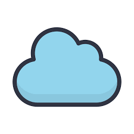
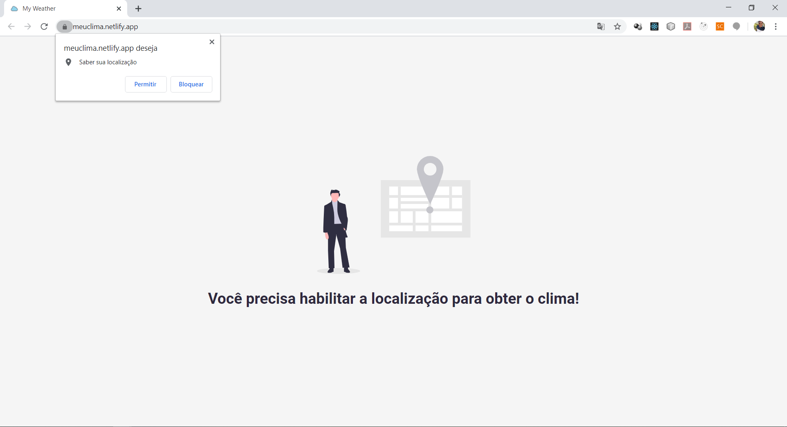
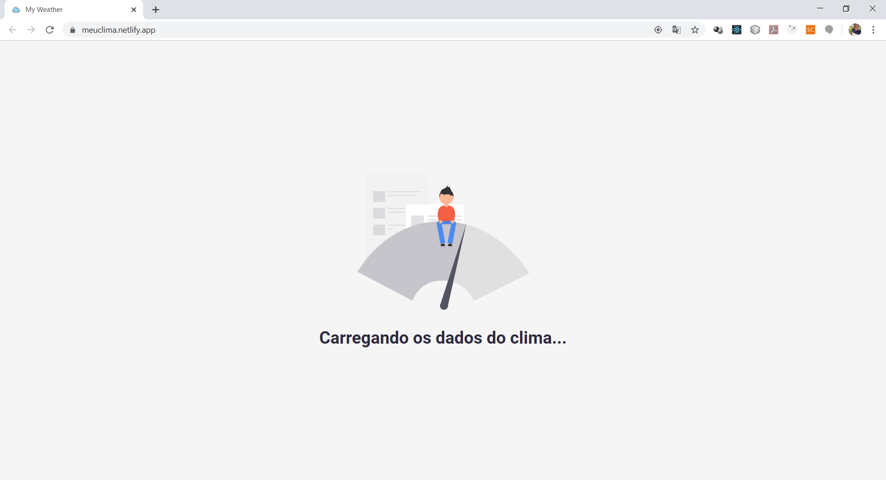
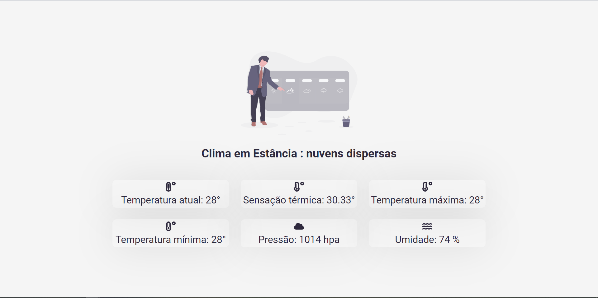

<h1 align="center">
    
    <br/>My Weather
</h1>

<p align="center">
  

  <a href="https://www.crisnaldocarvalho.com.br">
    
  </a>

  

  <a href="https://github.com/CrisnaldoSantos/my-weather/stargazers">
    
  </a>
</p>


## Descrição:
<p>
Front-end contruído em ReactJS que informa dados climáticos a partir da geolocalização do usuário. Os dados são consumidos da API OpenWeather.
</p>
<p>
São detalhados o nome da cidade, clima geral, temperatura, sensação térmica, temperatura máxima, temperatura mínima, pressão e umidade.
</p>

A aplicação pode ser acessada em produção através da url:
<a href="https://meuclima.netlify.app/" target="_blank">https://meuclima.netlify.app/</a>

## Instalação:
Após clonar o repositório, instale as dependências do projeto com os comandos abaixo via terminal:
```js
cd my-weather
yarn install                 //npm start *para quem está ulitizando o npm como gerênciador de dependências*
```
Abra o projeto no seu editor de código na sua preferência, renomeie o arquivo ".env.example" para ".env" e insira a sua chave de API do <a href="https://openweathermap.org/api" target="_blank">OpenWeatherMap </a> na váriável de ambiente presente no arquivo.
Com o terminal na pasta raiz do projeto, execute o comando:
```js
yarn start                  //npm start *para quem está ulitizando o Npm como gerênciador de dependências*
```

## Funcionamento:

A aplicação reage à três eventos:
- No primeiro momento caso o usuário não tenha habilitado a localização do dispositivo:
<br/>
<p align="center">
    
</p>

- No segundo é o momento que os dados estão sendo requisitados à API:
<br/>
<p align="center">
    
</p>

- No terceiro são exibidas as informações climáticas referentes a localização informada no momento atual:
<br/>
<p align="center">
    
</p>


